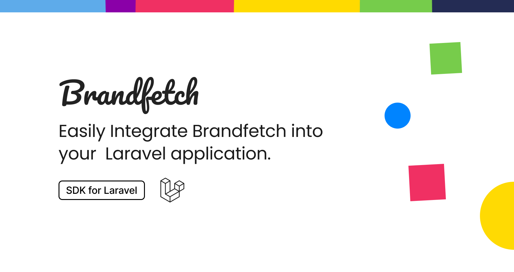

# Laravel SDK for Brandfetch

[](https://packagist.org/packages/helgesverre/brandfetch-sdk)
[](https://github.com/helgesverre/brandfetch-sdk/actions?query=workflow%3Arun-tests+branch%3Amain)
[](https://packagist.org/packages/helgesverre/brandfetch-sdk)

Laravel SDK for interacting with the [Brandfetch API](https://docs.brandfetch.com/reference/get-started), get your API
key from the [developer portal](https://developers.brandfetch.com/).

## Installation

You can install the package via composer:

```bash
composer require helgesverre/brandfetch-sdk
```

Then add your API key to your `.env` file.

```
BRANDFETCH_API_KEY="your-api-key"
```

You can publish the config file with:

```bash
php artisan vendor:publish --tag="brandfetch-sdk-config"
```

This is the contents of the published config file:

```php
return [
    "brandfetch_api_key" => env("BRANDFETCH_API_KEY")
];
```

## Usage

### Retrieve a brand

```php
// Create your own instance
$brandfetch = new HelgeSverre\Brandfetch(apiKey: "your-api-key");

// Or use the facade
use HelgeSverre\Brandfetch\Facades\Brandfetch;

$brand = Brandfetch::retrieveBrand("brandfetch.com")->json()
```

You can alternatively use the `->dto()` method to retireve a Spatie/Data DTO Object, which provides better auto-complete
support etc.

```php
$brand = Brandfetch::retrieveBrand("brandfetch.com")->dto()
```

You can take a look at the DTOs [here](./src/Data/Brand.php)

### Search for a Brand

```php
$brand = Brandfetch::searchBrand("brandfetch.com")->dto()
```

## Testing

## DTO Responses

### RetrieveBrand Request DTO

The `RetrieveBrand` request returns a `Brand` DTO which includes the following properties:

- `name`: ?string - The name of the brand.
- `domain`: string - The domain associated with the brand.
- `claimed`: bool - Whether the brand has been claimed.
- `description`: ?string - A short description of the brand.
- `longDescription`: ?string - A longer description of the brand.
- `links`: ?DataCollection of `Link` - A collection of links related to the brand.
- `logos`: ?DataCollection of `Logo` - A collection of logos associated with the brand.
- `colors`: ?DataCollection of `Color` - A collection of colors used by the brand.
- `fonts`: ?DataCollection of `Font` - A collection of fonts used by the brand.
- `images`: ?DataCollection of `Image` - A collection of images associated with the brand.

### SearchBrand Request DTO

The `SearchBrand` request returns a `SearchResult` DTO which includes the following properties:

- `name`: ?string - The name of the brand.
- `domain`: string - The domain associated with the brand.
- `claimed`: bool - Whether the brand has been claimed.
- `icon`: ?string - The icon of the brand.

Each `SearchResult` DTO is part of a `DataCollection` representing the search results.

```bash
composer test
```

## Credits

- [Helge Sverre](https://github.com/HelgeSverre)

## License

The MIT License (MIT). Please see [License File](LICENSE.md) for more information.

## Disclaimer

**NOTE: This is not an official product from Brandfetch.**

All logos, brands, and trademarks mentioned herein belong to their respective owners. The "Brandfetch" name, logo, and
brand are trademarks of "Brandfetch SA". This project and its creator are not affiliated with, endorsed by, sponsored
by, or associated with "Brandfetch SA" or any other entities mentioned in this documentation. All rights reserved to the
respective trademark owners. Use of these names, logos, and brands does not imply endorsement and is purely
illustrative.

